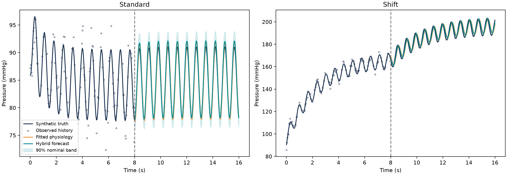
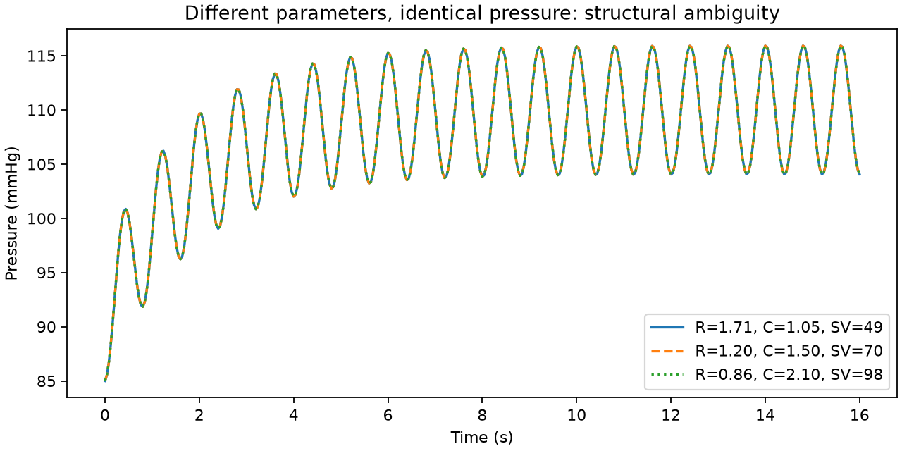

# Cardiovascular Digital Twin

**Patient-specific cardiovascular modeling with physiology, machine learning, and uncertainty quantification.**

A reproducible **in-silico research prototype** studying when sparse observations support personalized cardiovascular forecasts—and when the underlying parameters remain ambiguous.



## Research question

Can a simplified physiological model, fitted to an individual's observations and augmented with a learned residual, forecast cardiovascular dynamics under controlled changes to inflow?

This project implements a transparent Windkessel simulator. **It does not use CVSim/RCVSIM, clinical records, or a validated treatment-response model.** It is a foundation for further research, not evidence of clinical readiness or a claim of novel methodology.

## What is implemented

- Two-element Windkessel dynamics; a proximal resistance creates a three-element synthetic generator for mismatch experiments.
- Bounded nonlinear least-squares fitting of resistance, compliance, and initial pressure from incomplete, noisy observations.
- Four forecasting approaches: persistence, personalized physiology, data-driven Extra Trees, and physics plus a learned Extra Trees residual.
- Virtual-patient-disjoint training, calibration, and test sets.
- Patient-level split-conformal bands targeting an entire discrete forecast trajectory; patient-bootstrap MAE confidence intervals.
- Five test settings: standard, sparse, noisy, stronger inflow intervention, and shifted proximal impedance.
- A pressure-only structural-identifiability demonstration and a separate known-flow parameter-recovery experiment.
- Automated numerical and scientific checks, committed metrics, figures, split identifiers, and environment metadata.

## Quick start

Python 3.10 or newer:

```bash
git clone https://github.com/anab028/cardiovascular-digital-twin.git
cd cardiovascular-digital-twin
python -m venv .venv
source .venv/bin/activate   # Windows: .venv\Scripts\activate
python -m pip install -e '.[dev]'
pytest -q
cardiotwin --output results --seed 42
```

For the exact dependency versions used in the committed run, install `requirements-lock.txt` first. That lock records the tested Python 3.11 environment; other platforms may require compatible package versions.

A smaller smoke run: `cardiotwin --train 10 --calibration 10 --test 10 --output scratch-results`.

## Experimental design

| Item | Specification |
|---|---|
| Data | Entirely synthetic; no patient records or restricted downloads |
| History | First 8 seconds, nominally 25 Hz; random missing observations |
| Forecast | Next 8 seconds, open-loop |
| Known inputs | Heart rate, stroke volume, phase convention, and future inflow multiplier |
| Personalization | Fit R, C, and initial pressure on history only |
| Training | 80 virtual patients |
| Calibration | 30 separate virtual patients |
| Testing | 30 new virtual patients per scenario |
| Models | Persistence / fitted physics / Extra Trees / physics + Extra Trees residual |
| Target | Noise-free simulated arterial pressure, mmHg |
| Uncertainty | 90% nominal trajectory bands calibrated on standard-distribution patients |

These are short pulsatile dynamics experiments, **not hour-ahead clinical forecasts**. Stroke volume is known in the forecasting benchmark; this is a stronger observation assumption than heart rate and blood pressure alone. An intervention changes prescribed pump inflow and is known to the predictor. It is not a medication dose or a causal effect estimated from observational data.

Read the [generated results](results/REPORT.md), [methodology](docs/METHODS.md), and [research roadmap](docs/ROADMAP.md). Full numeric results are in [metrics.json](results/metrics.json).

## Results from the committed run

| Scenario | Physiology MAE | Hybrid MAE | Hybrid trajectory coverage |
|---|---:|---:|---:|
| Standard | 0.82 mmHg | 0.47 mmHg | 100% |
| Sparse observations | 0.86 mmHg | 0.58 mmHg | 87% |
| Noisy observations | 0.94 mmHg | 0.70 mmHg | 73% |
| Stronger inflow intervention | 1.29 mmHg | 0.72 mmHg | 63% |
| Shifted impedance | 2.39 mmHg | 1.67 mmHg | 17% |

These results come from seed 42 with 30 test patients per setting. The hybrid improves mean forecast error in this run, but its nominal 90% uncertainty bands fail under shift. Small synthetic errors do not establish clinical accuracy. See the complete report for all baselines and confidence intervals.

## Why identifiability matters

The two-element model satisfies:

```text
C dPc/dt = Q(t) - (Pc - Pv)/R
Pa = Pc + Z Q(t)
Q(t) = HR × SV / 60 × [1 + 0.8 sin(2π HR t / 60)] × intervention(t)
```

For Z = 0 and unknown stroke volume, transforming `R → R/k`, `C → kC`, and `SV → kSV` produces the same pressure trajectory. Pressure and heart rate therefore cannot uniquely recover all three parameters in this model.



The known-flow recovery experiment is intentionally separate from this ambiguity demonstration. Prediction intervals are not parameter posteriors and do not resolve structural non-identifiability.

## Repository structure

```text
cardiotwin/physiology.py   Simulator and patient parameter fitting
cardiotwin/benchmark.py    Cohorts, models, uncertainty, experiments, figures
tests/                   Numerical and methodological tests
docs/                    Assumptions, limitations, next experiments
results/                 Reproducible benchmark artifacts
```

## Limitations

This first version uses a small synthetic cohort and one seed. The same simulator family generates training and test data; shifted impedance is a controlled stress test, not independent physiological validation. Prescribed sinusoidal flow omits cardiac mechanics, baroreflexes, wave propagation, and realistic ejection morphology. Residual learning is a supervised correction rather than a neural differential equation. Uncertainty guarantees require exchangeability and do not extend to distribution shifts. Missingness is random, with eight early samples retained to make fitting feasible. No hyperparameter search or clinical outcome evaluation is claimed.

## References

- Westerhof et al., *The arterial Windkessel*, Medical & Biological Engineering & Computing (2009). https://doi.org/10.1007/s11517-008-0359-2
- PhysioNet, *Research Cardiovascular Simulator*: https://archive.physionet.org/physiotools/rcvsim/ — a future independent validation option, not used here.
- Angelopoulos and Bates, *A Gentle Introduction to Conformal Prediction and Distribution-Free Uncertainty Quantification* (2021). https://arxiv.org/abs/2107.07511

## Project status and CV description

**Status:** working synthetic research prototype; no clinical validation or publication claim.

Suggested description, once you have reviewed and can explain the implementation:

> Implemented and evaluated an in-silico cardiovascular digital-twin prototype combining Windkessel parameter fitting with residual machine learning; investigated parameter identifiability and forecast uncertainty under missing measurements and simulated physiological shifts.

Development used AI-assisted coding. Reproduce and critically review results before making scientific claims.
